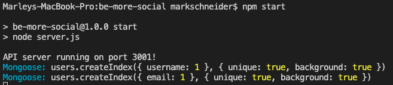

# be-more-social
An API for a social network web application where users can share their thoughts, react to friends’ thoughts, and create a friend list.

## Description
An API application for a social network web app that allows users to share their opinions, react to the thoughts of their friends, and construct a friend list. For routing, I utilized Express.js, a MongoDB database, and the Mongoose ODM. In addition to Express.js and Mongoose, I formatted timestamps using a JavaScript date library.

## Walkthrough Video 

## Screenshot of Live Application

## Table of Contents
* [Installation](#installation)
* [Dependencies](#dependencies)
* [Usage](#usage)
* [Contributors](#contributors)
* [Testing](#testing)
* [Questions](#questions)

## Installation
To install this project, clone this repository on Github and open it in your personal IDE. Make sure you have mongoDB and Insomnia installed on your local device. 

To create your package.json file, run `npm init -y`, `npm install express`, and `npm install mongoose`.

Finally, run `npm start` in the terminal to initiate the server to access routes in Insomnia and database information in MongoDB.

## Dependencies 
Express.js, Mongoose, MongoDB, node.js

## Usage
In your IDE termianl, open the command line and type either `node server.js` or `npm start` to run the server. Once started, you will be able to use an API testing software to make different requests to each API endpoint.

## Contributors 
Thank you to AskBCS for helping me fix my server.js file and polish up my routes!

## License

This project is licensed under the [MIT](https://opensource.org/license/mit/) license. 

## Questions
If you have questions, please send them [here](mailto:marleysue@gmail.com?subject=[GitHub]%20Dev%20Connect) or visit [github/marleyschneiderr](https://github.com/marleyschneiderr).
